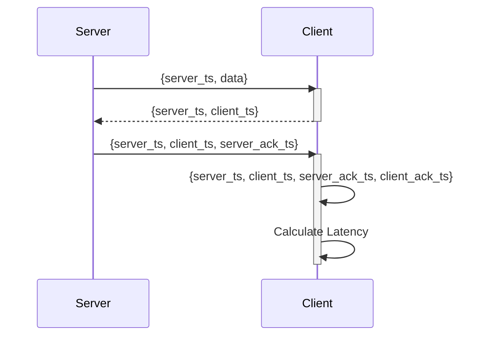
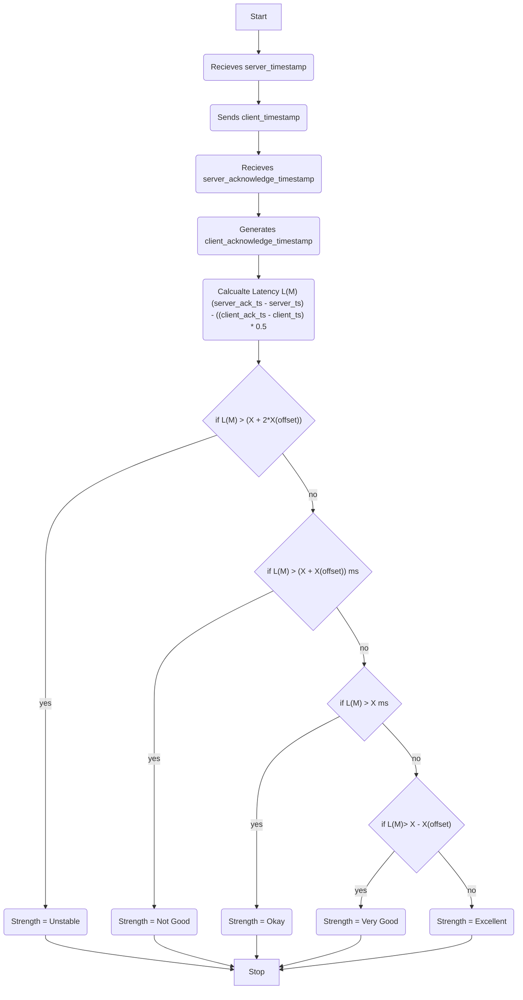
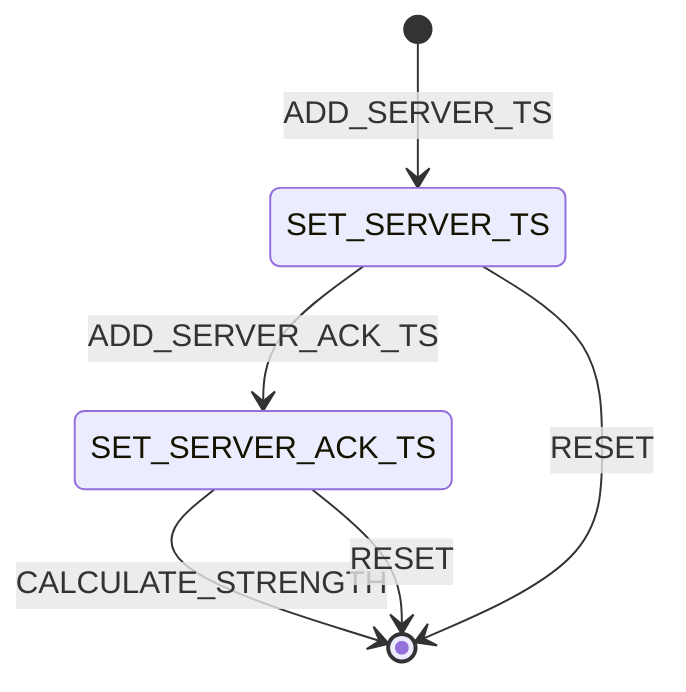

# Calculate the websocket strength
It is required to calculate the strength of the websocket, such that it can be used to show as a visualization as well as it can be used by the client to make decisions based on it.

To accurately calculate the latency a round trip of message between the client and server is required. The Client echo the same message sent by the Server back to the server. We can find the roundtrip latency by calculating the time elasped between sending of original message and recieving the echo'd message Dividing it by 2 gives the one way latency.

**Note :** Here this works properly if the message sent is small and that the socket is not throttled. 



1. Server sends the message (M) to the client whose latency needs to be measured. Server adds `server_ts` to the message.
2. Client sends an acknowledgement message (ACK) to the server by echoing `server_ts` and attaching its own timestamp.
3. Server echos the ACK message by attaching another timestamp `server_ack_ts.
4. Client captures the timestamp `client_ts` once it recieves the ACK message.
 

By using these timestamps we can calculate the latency of original message M as follows:
```
Latency (M) = (server_ack_ts - server_ts) - ((client_ack_ts - client_ts) * 0.5 )
```

Once calculated a reference metric for the strength is assumed, which considers:
1. Strength to be `Unstable` if the latency is greater than 90.
2. Strength to be `Not Good` if the latency is between 80 and 90.
3. Strength to be `Okay` if the latency is between 70 and 80.
4. Strength to be `Very Good` if the latency is between 67 to 70.
5. Strength to be `Excellent` if the latency is betwe



The states are maintained to make sure the calucaltion progress in a proper way. 
1. When an action `ADD_SERVER_TS` then the object changes to a state of `SET_SERVER_TS`.
2. When an action `ADD_SERVER_ACK_TS` then the object changes from `SET_SERVER_TS` to `SET_SERVER_ACK_TS`
3. When an action `CALCULATE_STRENGTH` it resets from `SET_SERVER_ACK_TS` to initial state.
4. When an action `RESET` is called from `SET_SERVER_TS` and `SET_SERVER_ACK_TS` it resets to initial state.
 
## Input
### server_ts (required) : string
Timestamp when original message M was sent from the server
### client_ts (required) : string
Timestamp when original message M was recieved by the client
### server_ack_ts (required) string
Timestamp when ACK message was recieved by the server.
### client_ack_ts (required) string
Timestamp when ACK response was recieved by the client.
### ref_optimal_latency (optional)
```
type refOptimalLatency = { optimal_val: int, offset: int } 
```
Reference to calculate the latency based on the `optimal_val` value and `offset`

## Output
###  Strength 
The strength of the websocket connection with values either of :
- Unstable
- Not Good
- Okay
- Very Good
- Excellent
## Interface
### RefOptimalLatency
```
type refOptimalLatency = { optimal_val: int, offset: int }
```
- The optimal value refers to a value that can be considered as an optimal latency to calculate the strength.
- The offset is the value by which different grades of strength can be maipulated. 

The default calculates with optimal_value as 200ms and offset as 50 ms. Thus the grades of strength can be considered as
- latency > X + 2(offset) = latency > 200 + (2 * 50) = 300 ms ; then `Unstable`
- latency > X + offset = latency > 200 + 50 = 250 ms ; then `Not Good`
- latency > X  = latency > 200  ; then `Okay`
- latency > X - offset = latency > 200 - 50 = 150 ms ; then `Very Good`
- else `Excellent`

### WsStrengthState 
```
type WsStrengthState =  SET_SERVER_TS | SET_SERVER_ACK_TS
```
### WsStrengthAction 

```
type WsStrengthAction = ADD_SERVER_TS |  ADD_SERVER_ACK_TS | CALCULATE_STRENGTH | RESET
```

### WsStrengthValue
```
type WsStrengthState = UNSTABLE | NOT_GOOD | OKAY | VERY_GOOD | EXCELLENT
```
### WsStrength
```
type WsStrengthProp = {
	server_ts: int
	client_ts: option(int)
	server_ack_ts: option(int)
	client_ack_ts: option(int)
	strength: option(WsStrengthState)
	state : WsStrengthState
	ref: RefOptimalLatency
}
```
### setRef(ref: RefOptimalLatency) => WsStrengthProp
Set a reference value to calculate the strength based on latency.
### setServerTs(serverTs: int) => WsStrengthProp
Sets the server timestamp to the `WsStrengthProp`
### setServerAckTs(serverAckTs: int) => WsStrengthProp
Add the server acknowledge timestamp to the WsStrengthProp
### calculateStrength(WsStrengthProp) => WsStrengthProp
Calculate the Strength of the Websocket connection
### reset() => WsStrengthProp
Resets the value of the `WsStrengthProp`
## Test cases
| Test case ID | Input | Expected Output |
|--------------|-------|-----------------|
|	AAA001 | The strength is calculated without recieving any of the `server_ts`, `client_ts`, `server_ack_ts` or `client_ack_ts` | The system should prompt saying the corresponding value need to be set |
| AAA002 | When setting a reference and calculating the strength with offset the value goes to negetive values | Should prompt an error stating that it is not set and that it should adhere to default values|
| AAA003 | Setting a reference with a valid values | The strength should adhere to the reference values set |
| AAA004 | If a reference value is not set | The strength should be calculated based on the default value |
| AAA005 | An invalid optimal value is provided when setting reference | It should prompt with an error and resets to default values|
| AAA0006 | An invalid offset value is provided when setting reference | It should prompt with an error and resets to default values | 
| AAA007 | Strength is calculated with valid values | It should provide the strength properly | 
| AAA008 | An invalid server and server acknowledge timestamp is set | It should prompt the client with an error | 
| AAA009 | A reset is called once the server timestamp is set | It should reset to initial value|
| AAA010 | A reset is called once the server acknowledge timestamp is set | It should reset to initial value |

## Acknowledgements
- https://www.securedgenetworks.com/blog/wifi-signal-strength
- https://ankitbko.github.io/blog/2022/06/websocket-latency/#:~:text=If%20the%20original%20message%20is,2%20gives%20one%20way%20latency.
- https://www.pingplotter.com/wisdom/article/is-my-connection-good
