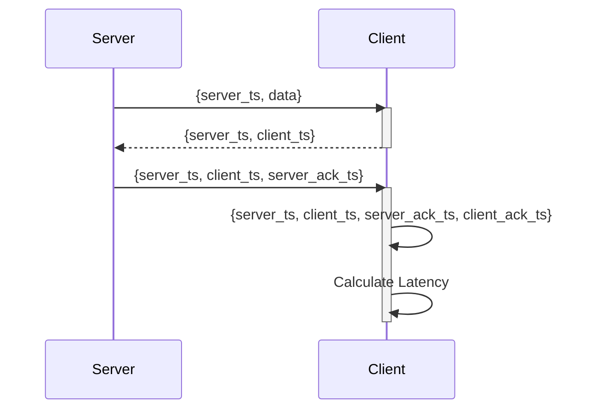
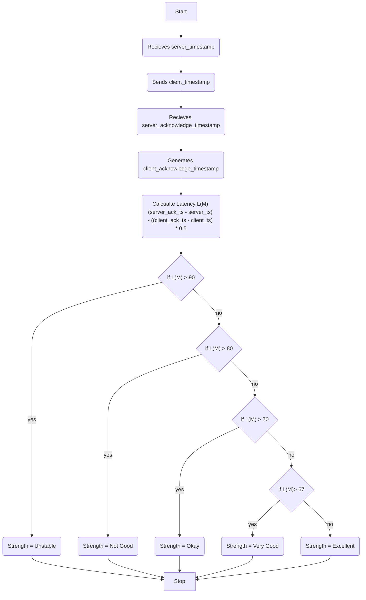
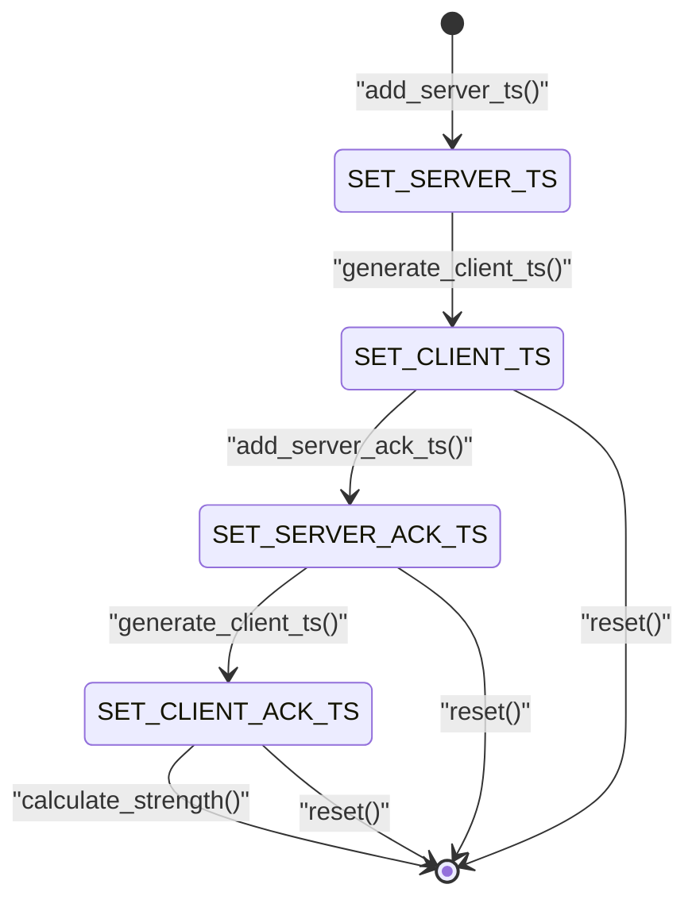

# Calculate the websocket strength
It is required to calculate the strength of the websocket, such that it can be used to show as a visualization as well as it can be used by the client to make decisions based on it.







## Input
### server_ts
Timestamp when original message M was sent from the server
### client_ts 
Timestamp when original message M was recieved by the client
### server_ack_ts 
Timestamp when ACK message was recieved by the server.
### client_ack_ts
Timestamp when ACK response was recieved by the client

## Output
###  Strength 
The strength of the websocket connection with values either of :
- Unstable
- Not Good
- Okay
- Very Good
- Excellent
## Interface
### WsStrengthState 
```
type WsStrengthState = SET_CLIENT_TS | SET_SERVER_TS | SET_SERVER_ACK_TS | SET_CLIENT_ACK_TS
```
### WsStrengthAction = ADD_SERVER_TS | GENERATE_CLIENT_TS | ADD_SERVER_ACK_TS | GENERATE_CLIENT_ACK_TS | CALCULATE_STRENGTH | RESET
```
type WsStrengthAction = 
```
### WsStrengthValue
```
type WsStrengthState = UNSTABLE | NOT_GOOD | OKAY | VERY_GOOD | EXCELLENT
```
### WsStrength
```
type WsStrengthProp = {
	server_ts: int
	client_ts: option(int)
	server_ack_ts: option(int)
	client_ack_ts: option(int)
	strength: option(WsStrengthState)
	state : WsStrengthState
}
```
### setServerTs(serverTs: int) => WsStrengthProp
Sets the server timestamp to the `WsStrengthProp`
### generateClientTs() => WsStrengthProp
Generates the client timestamp when the server responds with its timestamp.
### setServerAckTs(serverAckTs: int) => WsStrengthProp
Add the server acknowledge timestamp to the WsStrengthProp
### generateClientAckTs() => WsStrengthProp
Generates the client timestamp when the server responds with its acknowledgement timestamp.
### calculateStrength(WsStrengthProp) => WsStrengthProp
Calculate the Strength of the Websocket connection
### reset() => WsStrengthProp
Resets the value of the `WsStrengthProp`
## Test cases
| Test case ID | Input | Expected Output |
|--------------|-------|-----------------|
|	AAA001 | The strength is calculated without recieving any of the `server_ts`, `client_ts`, `server_ack_ts` or `client_ack_ts` | The system should prompt saying the corresponding value need to be set |

## Acknowledgements
- https://www.securedgenetworks.com/blog/wifi-signal-strength
- https://ankitbko.github.io/blog/2022/06/websocket-latency/#:~:text=If%20the%20original%20message%20is,2%20gives%20one%20way%20latency.
